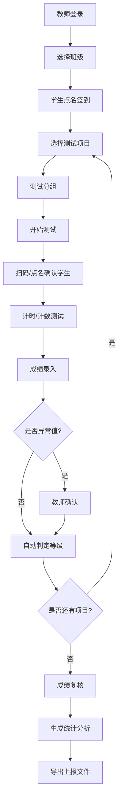

# 智慧体育平板端体测采集应用 - 产品需求文档

## 1. 产品概述

智慧体育平板端体测采集应用是一款专为学校体育老师设计的操场现场体测数据采集工具，解决传统纸质记录效率低、易出错、统计繁琐的痛点。通过平板端触控操作，实现学生身份快速识别、成绩实时录入、等级自动判定、数据批量复核与智能分析的全流程数字化管理。

### 1.1 产品定位
- 目标用户：中小学及高校体育教师、体育教研人员
- 使用场景：操场户外体测、室内体育馆测试、体质健康标准达标测试
- 核心价值：提升体测效率50%以上，消除人工转录错误，自动生成上报数据

## 2. 核心功能

### 2.1 用户角色
| 角色 | 登录方式 | 核心权限 |
|------|----------|----------|
| 体育教师 | 工号+密码/扫码登录 | 班级管理、成绩录入、复核、统计分析、数据导出 |
| 教研管理员 | 管理员账号 | 全校数据查看、教师权限管理、标准配置 |

### 2.2 功能模块
1. **班级名单界面**：班级选择、学生名册展示、点名签到、扫码识别、缺测/缓测标记
2. **项目测试界面**：体测项目选择、项目配置、测试分组、计时/计数工具集成
3. **现场录入界面**：成绩快速录入、手动计时联动、拍照留证、等级即时判定、异常值提醒
4. **成绩复核界面**：异常值高亮、批量复核、成绩修改留痕、个人成绩单生成
5. **统计分析界面**：班级达标率、项目得分分布、年级对比、教师录入记录、导出上报文件

### 2.3 页面详情
| 页面名称 | 模块名称 | 功能描述 |
|---------|---------|---------|
| 班级名单 | 班级选择器 | 下拉切换年级/班级，显示班级人数、已测人数统计 |
| 班级名单 | 学生名册 | 列表展示学生头像、姓名、学号、性别、签到状态、已测项目数 |
| 班级名单 | 点名签到 | 点击学生行切换签到状态，支持批量全选签到 |
| 班级名单 | 扫码识别 | 调用平板摄像头扫描学生二维码/条形码，快速定位学生 |
| 班级名单 | 状态标记 | 单个/批量标记缺测、缓测、免测状态，并可填写备注 |
| 项目测试 | 项目列表 | 卡片式展示50米跑、1000米/800米跑、立定跳远、仰卧起坐、引体向上、坐位体前屈、肺活量、身高体重BMI等项目 |
| 项目测试 | 项目配置 | 配置测试轮次、分组人数、计时模式（自动/手动）、评分标准 |
| 项目测试 | 测试分组 | 按学号/性别自动分组或手动拖拽分组，显示分组测试进度 |
| 项目测试 | 计时工具 | 大屏计时器，支持同时计时多人，记录成绩精确到0.01秒 |
| 现场录入 | 快速录入 | 数字键盘快速输入秒数/次数，支持上/下一位学生快捷切换 |
| 现场录入 | 手动计时联动 | 计时器停止后自动将成绩填入当前学生录入框 |
| 现场录入 | 拍照留证 | 调用摄像头拍摄测试现场照片，关联到学生该项目成绩 |
| 现场录入 | 等级判定 | 根据国家学生体质健康标准实时计算得分与等级（优秀/良好/及格/不及格） |
| 现场录入 | 异常提醒 | 成绩超出合理阈值时红色高亮提示，需教师二次确认 |
| 成绩复核 | 异常值筛选 | 按异常值、缺测、缓测、不及格等条件筛选记录 |
| 成绩复核 | 批量复核 | 多选记录批量标记"已复核"，支持批量修改成绩 |
| 成绩复核 | 修改留痕 | 所有成绩修改记录操作人、修改时间、原值、新值 |
| 成绩复核 | 个人成绩单 | 生成单个学生所有项目成绩单，含雷达图展示 |
| 统计分析 | 达标率统计 | 展示班级总分达标率、各单项达标率，与年级/全校对比 |
| 统计分析 | 得分分布 | 柱状图展示优秀/良好/及格/不及格人数分布 |
| 统计分析 | 项目分析 | 各项目平均分、最高分、最低分、标准差统计 |
| 统计分析 | 教师记录 | 查看每位教师的录入记录：录入条数、修改次数、复核率 |
| 统计分析 | 数据导出 | 导出Excel/CSV格式上报文件，支持按国家标准模板导出 |

## 3. 核心流程

### 3.1 体测采集主流程
教师登录应用 → 选择授课班级 → 学生签到点名 → 选择体测项目 → 进行测试分组 → 现场录入成绩（计时/计数/拍照） → 系统自动判定等级 → 标记异常值 → 批量复核确认 → 生成统计报表 → 导出上报数据

### 3.2 流程图

## 4. 用户界面设计

### 4.1 设计风格
- **主色调**：运动蓝 (#1E6FFF) 作为主色，代表专业与活力；活力橙 (#FF6B35) 作为强调色，用于关键操作和提醒
- **辅助色**：成功绿 (#10B981)、警告黄 (#F59E0B)、危险红 (#EF4444) 用于状态标识
- **背景色**：浅灰蓝 (#F0F4F8) 为页面底色，白色卡片承载内容，层次感清晰
- **按钮风格**：大圆角(12px)、阴影柔和、触控目标≥48×48px，适配平板手指操作
- **字体**：中文使用「思源黑体」，数字使用「JetBrains Mono」等宽字体，确保秒表数字清晰对齐
- **布局风格**：卡片式布局、左侧导航+右侧内容区、顶部操作栏固定
- **图标风格**：线性图标，2px描边，运动元素拟人化设计
- **动效**：页面切换滑入动画、按钮按下缩放反馈、成绩录入成功弹跳动画

### 4.2 页面设计概要
| 页面名称 | 模块名称 | UI元素 |
|---------|---------|--------|
| 班级名单 | 班级选择器 | 顶部横滑标签切换，选中态蓝色下划线 |
| 班级名单 | 学生名册 | 左侧头像+右侧信息的列表项，状态色条标识签到状态 |
| 班级名单 | 扫码按钮 | 右下角悬浮圆形按钮，橙色主按钮带扫描动效 |
| 项目测试 | 项目卡片 | 两行布局卡片，图标+名称+已测进度条 |
| 项目测试 | 计时器 | 全屏黑色数字显示，毫秒级精度，开始/停止/重置大按钮 |
| 现场录入 | 录入面板 | 大号数字输入框，上下学生切换按钮，等级实时显示卡片 |
| 现场录入 | 拍照区域 | 预览框+快门按钮，缩略图展示已拍照片 |
| 成绩复核 | 数据表格 | 斑马纹表格，异常值行红色背景，支持列排序 |
| 成绩复核 | 批量操作栏 | 顶部固定操作栏，显示已选数量、复核、导出按钮 |
| 统计分析 | 图表区 | 大屏柱状图+环形图，支持点击钻取详情 |
| 统计分析 | 教师记录 | 时间线样式展示录入操作历史 |

### 4.3 响应式设计
- **设计优先**：平板端优先设计，目标分辨率 1280×800 / 1920×1200（横屏）
- **触控优化**：所有可点击元素最小尺寸 48×48px，列表项高度≥64px，按钮间距≥16px
- **横屏适配**：左侧导航栏固定宽度240px，右侧内容区自适应
- **离线支持**：关键数据本地缓存，弱网环境仍可录入，联网后自动同步

### 4.4 户外可读性
- 高对比度配色，文字与背景对比度≥4.5:1
- 重要数字字号≥32px，室外强光下清晰可读
- 支持亮色/户外增强模式，进一步提升屏幕亮度下的可读性
