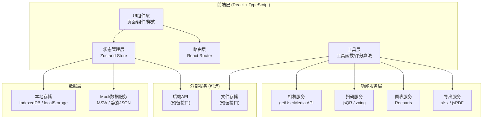

# 智慧体育平板端体测采集应用 - 技术架构文档

## 1. 架构设计



## 2. 技术选型说明

| 技术领域 | 选型方案 | 选型理由 |
|---------|---------|---------|
| 前端框架 | React 18 + TypeScript 5 | 组件化开发、类型安全、生态成熟、适合复杂交互应用 |
| 构建工具 | Vite 5 | 开发启动快、HMR即时更新、生产构建优化 |
| 样式方案 | Tailwind CSS 3 | 原子化CSS、开发效率高、一致的设计系统 |
| 状态管理 | Zustand 4 | 轻量、简洁、TypeScript友好、无需Provider嵌套 |
| 路由管理 | React Router 6 | 官方标准路由、支持嵌套路由与懒加载 |
| UI组件库 | Headless UI + 自定义组件 | 无样式约束、完全定制化、适配平板触控体验 |
| 图表库 | Recharts 2 | React原生、API简洁、支持响应式、动画效果好 |
| 扫码识别 | jsQR | 轻量、纯JS实现、浏览器原生支持 |
| 数据导出 | xlsx + jsPDF | Excel/PDF导出、支持自定义模板格式 |
| 本地存储 | IndexedDB (Dexie.js) | 大容量存储、支持离线数据持久化 |
| 代码规范 | ESLint + Prettier | 统一代码风格、提前发现潜在问题 |

## 3. 目录结构

```
src/
├── assets/                  # 静态资源
│   ├── icons/               # SVG图标
│   └── images/              # 图片资源
├── components/              # 公共组件
│   ├── layout/              # 布局组件
│   │   ├── Sidebar.tsx      # 侧边导航
│   │   ├── Header.tsx       # 顶部栏
│   │   └── AppLayout.tsx    # 主布局
│   ├── common/              # 通用组件
│   │   ├── Button.tsx       # 按钮
│   │   ├── Card.tsx         # 卡片
│   │   ├── Modal.tsx        # 弹窗
│   │   ├── Table.tsx        # 表格
│   │   └── Tag.tsx          # 标签
│   └── business/            # 业务组件
│       ├── StudentCard.tsx  # 学生卡片
│       ├── Timer.tsx        # 计时器
│       ├── CameraView.tsx   # 相机预览
│       └── GradeBadge.tsx   # 等级徽章
├── pages/                   # 页面组件
│   ├── class-list/          # 班级名单页
│   │   └── index.tsx
│   ├── project-test/        # 项目测试页
│   │   └── index.tsx
│   ├── data-entry/          # 现场录入页
│   │   └── index.tsx
│   ├── review/              # 成绩复核页
│   │   └── index.tsx
│   └── statistics/          # 统计分析页
│       └── index.tsx
├── store/                   # 状态管理
│   ├── appStore.ts          # 全局应用状态
│   ├── classStore.ts        # 班级/学生状态
│   ├── testStore.ts         # 测试/成绩状态
│   └── userStore.ts         # 用户状态
├── services/                # 业务服务层
│   ├── api.ts               # API封装
│   ├── cameraService.ts     # 相机服务
│   ├── qrService.ts         # 扫码服务
│   ├── exportService.ts     # 导出服务
│   └── storageService.ts    # 本地存储服务
├── utils/                   # 工具函数
│   ├── scoring.ts           # 评分算法
│   ├── formatter.ts         # 格式化工具
│   ├── validator.ts         # 校验工具
│   └── constants.ts         # 常量定义
├── types/                   # TypeScript类型定义
│   ├── student.ts           # 学生相关类型
│   ├── test.ts              # 测试相关类型
│   └── index.ts             # 类型汇总
├── mock/                    # Mock数据
│   ├── students.ts          # 学生模拟数据
│   ├── classes.ts           # 班级模拟数据
│   └── standards.ts         # 评分标准数据
├── hooks/                   # 自定义Hooks
│   ├── useTimer.ts          # 计时器Hook
│   ├── useCamera.ts         # 相机Hook
│   └── useLocalStorage.ts   # 本地存储Hook
├── App.tsx                  # 根组件
├── main.tsx                 # 入口文件
└── index.css                # 全局样式
```

## 4. 路由定义

| 路由路径 | 页面名称 | 说明 |
|---------|---------|-----|
| `/` | 重定向至班级名单页 | 默认入口 |
| `/class-list` | 班级名单 | 班级选择、学生名册、点名签到、扫码识别 |
| `/project-test` | 项目测试 | 项目列表、测试配置、分组管理、计时器 |
| `/data-entry` | 现场录入 | 成绩录入、拍照留证、等级判定、异常提醒 |
| `/review` | 成绩复核 | 异常值筛选、批量复核、成绩单预览 |
| `/statistics` | 统计分析 | 达标率统计、图表分析、教师记录、数据导出 |

## 5. 数据模型

### 5.1 实体关系图 (ER Diagram)

```mermaid
erDiagram
    TEACHER ||--o{ CLASS : "授课"
    TEACHER ||--o{ TEST_RECORD : "录入"
    CLASS ||--o{ STUDENT : "包含"
    STUDENT ||--o{ TEST_RECORD : "拥有"
    TEST_PROJECT ||--o{ TEST_RECORD : "关联"
    TEST_RECORD ||--o{ SCORE_LOG : "产生"
    TEST_RECORD ||--o{ PHOTO : "关联"

    TEACHER {
        string id PK "教师ID"
        string name "姓名"
        string employeeNo "工号"
        string password "密码(加密)"
        string subject "学科"
    }

    CLASS {
        string id PK "班级ID"
        string name "班级名称"
        string grade "年级"
        int studentCount "人数"
        string teacherId FK "班主任ID"
    }

    STUDENT {
        string id PK "学生ID"
        string name "姓名"
        string studentNo "学号"
        string gender "性别"
        int age "年龄"
        float height "身高(cm)"
        float weight "体重(kg)"
        string classId FK "班级ID"
        string qrCode "二维码标识"
        string status "签到状态"
    }

    TEST_PROJECT {
        string id PK "项目ID"
        string name "项目名称"
        string unit "单位"
        string type "类型: 计时/计数/计量"
        string gender "适用性别"
        int minAge "最小年龄"
        int maxAge "最大年龄"
    }

    TEST_RECORD {
        string id PK "记录ID"
        string studentId FK "学生ID"
        string projectId FK "项目ID"
        string teacherId FK "录入教师ID"
        float score "成绩值"
        int points "得分"
        string grade "等级"
        string status "状态: 正常/异常/缺测/缓测"
        boolean reviewed "是否已复核"
        datetime createdAt "创建时间"
        datetime updatedAt "更新时间"
        string remark "备注"
    }

    SCORE_LOG {
        string id PK "日志ID"
        string recordId FK "成绩记录ID"
        string teacherId FK "操作教师ID"
        float oldScore "原成绩"
        float newScore "新成绩"
        string action "操作类型"
        datetime createdAt "操作时间"
    }

    PHOTO {
        string id PK "照片ID"
        string recordId FK "成绩记录ID"
        string url "照片地址/base64"
        datetime createdAt "拍摄时间"
    }
```

### 5.2 核心数据结构定义 (TypeScript)

```typescript
// 教师
interface Teacher {
  id: string;
  name: string;
  employeeNo: string;
  subject: string;
}

// 班级
interface ClassInfo {
  id: string;
  name: string;
  grade: string;
  studentCount: number;
  teacherId: string;
}

// 学生
type AttendanceStatus = 'present' | 'absent' | 'delayed' | 'exempted';

interface Student {
  id: string;
  name: string;
  studentNo: string;
  gender: 'male' | 'female';
  age: number;
  height?: number;
  weight?: number;
  classId: string;
  qrCode: string;
  attendanceStatus: AttendanceStatus;
  testedProjects: number;
  totalProjects: number;
}

// 测试项目
type ProjectType = 'timing' | 'counting' | 'measuring';

interface TestProject {
  id: string;
  name: string;
  unit: string;
  type: ProjectType;
  icon: string;
  gender: 'male' | 'female' | 'both';
  description: string;
}

// 成绩记录
type RecordStatus = 'normal' | 'abnormal' | 'absent' | 'delayed';
type GradeLevel = 'excellent' | 'good' | 'pass' | 'fail';

interface TestRecord {
  id: string;
  studentId: string;
  projectId: string;
  teacherId: string;
  score: number | null;
  points: number;
  grade: GradeLevel | null;
  status: RecordStatus;
  reviewed: boolean;
  photos: string[];
  createdAt: string;
  updatedAt: string;
  remark?: string;
}

// 评分标准项
interface StandardItem {
  gender: 'male' | 'female';
  ageRange: [number, number];
  grade: GradeLevel;
  minScore: number;
  maxScore: number;
  points: number;
}

// 修改日志
interface ScoreLog {
  id: string;
  recordId: string;
  teacherId: string;
  teacherName: string;
  oldScore: number | null;
  newScore: number | null;
  action: 'create' | 'update' | 'review';
  createdAt: string;
}

// 统计数据
interface Statistics {
  classId: string;
  totalStudents: number;
  testedStudents: number;
  passRate: number;
  excellentRate: number;
  goodRate: number;
  failRate: number;
  projectStats: ProjectStat[];
}

interface ProjectStat {
  projectId: string;
  projectName: string;
  avgScore: number;
  maxScore: number;
  minScore: number;
  passRate: number;
}
```

## 6. 状态管理设计

### 6.1 Store 划分

```typescript
// userStore - 用户状态
interface UserState {
  currentTeacher: Teacher | null;
  isLoggedIn: boolean;
  login: (employeeNo: string, password: string) => Promise<boolean>;
  logout: () => void;
}

// classStore - 班级与学生状态
interface ClassState {
  classes: ClassInfo[];
  currentClass: ClassInfo | null;
  students: Student[];
  filteredStudents: Student[];
  searchKeyword: string;
  setCurrentClass: (classId: string) => void;
  setSearchKeyword: (keyword: string) => void;
  updateStudentStatus: (studentId: string, status: AttendanceStatus) => void;
  batchUpdateStatus: (studentIds: string[], status: AttendanceStatus) => void;
  findStudentByQR: (qrCode: string) => Student | undefined;
}

// testStore - 测试与成绩状态
interface TestState {
  projects: TestProject[];
  currentProject: TestProject | null;
  records: TestRecord[];
  selectedStudentIds: string[];
  logs: ScoreLog[];
  timerState: TimerState;
  setCurrentProject: (projectId: string) => void;
  addRecord: (record: Omit<TestRecord, 'id' | 'createdAt' | 'updatedAt'>) => void;
  updateRecord: (recordId: string, data: Partial<TestRecord>) => void;
  batchReview: (recordIds: string[]) => void;
  startTimer: () => void;
  stopTimer: () => void;
  resetTimer: () => void;
}
```

## 7. 评分算法设计

### 7.1 国家学生体质健康标准评分逻辑

```typescript
/**
 * 根据项目、性别、年龄、成绩计算得分与等级
 * @param projectId 项目ID
 * @param gender 性别
 * @param age 年龄
 * @param score 成绩值
 * @returns { points: number, grade: GradeLevel, isAbnormal: boolean }
 */
function calculateScore(
  projectId: string,
  gender: 'male' | 'female',
  age: number,
  score: number
): { points: number; grade: GradeLevel; isAbnormal: boolean }
```

- 采用查表法，根据《国家学生体质健康标准》预置各项目各年龄段评分表
- 支持插值计算：成绩在两个标准值之间时按线性插值计算得分
- 异常值判定：超出合理范围（如50米跑<5秒或>20秒）标记为异常值需确认
- 等级划分：90分及以上=优秀，80-89=良好，60-79=及格，<60=不及格

## 8. 导出功能设计

### 8.1 支持导出格式

| 格式 | 用途 | 实现方式 |
|-----|------|---------|
| Excel (.xlsx) | 标准上报文件 | xlsx库生成，支持多sheet、样式、公式 |
| CSV | 数据交换 | 原生Blob+URL.createObjectURL |
| PDF | 个人成绩单 | jsPDF+html2canvas渲染 |

### 8.2 上报文件模板
- 按照教育部《国家学生体质健康标准数据上报系统》模板格式
- Sheet1: 基本信息（学号、姓名、性别、出生日期、班级）
- Sheet2: 体测成绩（各项目成绩、得分、等级）
- Sheet3: 统计汇总（班级达标率、各项目统计）
